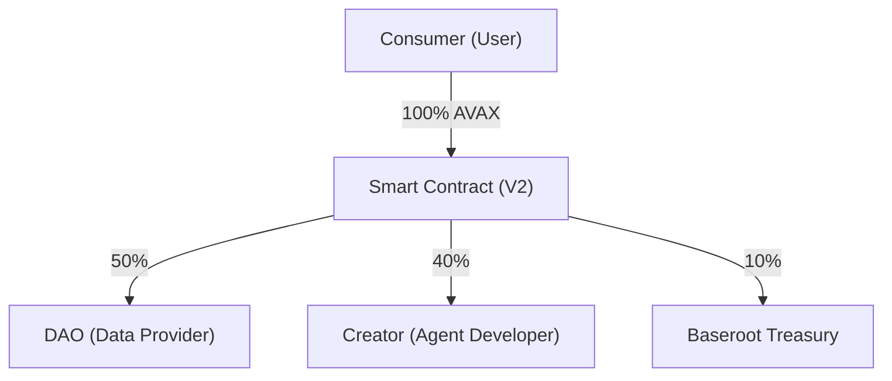

# Baseroot.io — DeSci AI Agent Marketplace (V2)

The decentralized AI Agent Marketplace powered by the Avalanche (AVAX) blockchain.


## Overview

Baseroot.io is a decentralized marketplace protocol designed to facilitate secure and transparent interaction between data providers (DAOs), AI agent developers (Creators), and end-users (Consumers). The platform is specifically engineered for the DeSci (Decentralized Science) community, utilizing an Attestation-based Inference model and Avalanche Smart Contract-based revenue distribution to ensure data sovereignty and fair compensation.

> [!IMPORTANT]
> For a detailed analysis of the protocol's vision, economic model, and technical architecture, please refer to the **[Baseroot V2 Whitepaper](./WHITEPAPER.md)**.

## Revenue Distribution Model (50/40/10)

All transactions within the platform are automatically processed and distributed by the `BaserootMarketplaceV2.sol` smart contract according to the following logic:



- **Transparency:** All distributions occur on-chain and are fully verifiable via Snowtrace.
- **Incentive Alignment:** Data providers (DAOs) receive the largest share, incentivizing the provision of high-value research data which serves as the protocol's primary intelligence source.

## Key Features

### Blockchain and Economics
- **Avalanche Fuji Testnet:** Low-latency and reliable C-Chain integration for all financial operations.
- **Virtual Treasury (Claim):** A Web 2.5 accounting-based settlement system allowing users to claim earned balances to their wallets.
- **On-Chain Gateway:** External agent access is gated and verified through license checks on the smart contract.

### Data Privacy and ZK-RAG
- **Zero-Knowledge Inference:** DAO datasets are processed without exposure to the end-user or the base model. The LLM generates insights while maintaining raw data confidentiality.
- **Dataset Provenance:** Datasets are registered on-chain with immutable hashes via the `registerDataset` function to protect intellectual property.

### Professional Interface
- **Modern Aesthetic:** A formal interface utilizing glassmorphism and amber highlights for a professional, high-tech experience.
- **Role-Based Portals:** Dedicated dashboards tailored for the specific needs of Consumers, Developers, and DAO Administrators.

## Technical Stack

- **Frontend:** React 19, Vite, TailwindCSS 4, Wagmi/Viem, tRPC.
- **Backend:** Node.js/Express, Firebase Firestore (prefixed collections), Firebase Auth.
- **Smart Contract:** Solidity (BaserootMarketplaceV2) deployed on the Fuji Testnet.

## Installation and Deployment

### 1. Clone the repository and install dependencies
```bash
pnpm install
```

### 2. Environment Configuration
Copy the `.env.example` file to `.env` and configure the Avalanche Fuji contract address:
```bash
VITE_BASEROOT_MARKETPLACE_ADDRESS=0x3e251B4d78b0351A9E5a7d3df134b8e5870e7782
```

### 3. Start the Development Server
```bash
pnpm dev
```

## Contract Information

- **Network:** Avalanche Fuji (Chain ID: 43113)
- **V2 Smart Contract Address:** `0x3e251B4d78b0351A9E5a7d3df134b8e5870e7782`
- **Blockchain Explorer:** [Snowtrace Fuji](https://testnet.snowtrace.io/address/0x3e251B4d78b0351A9E5a7d3df134b8e5870e7782)

---
**Built for the DeSci Community • Powered by Avalanche (AVAX)**
© 2026 Baseroot.io
