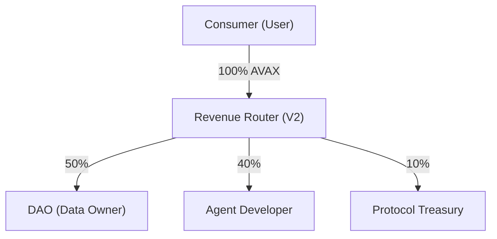

# Baseroot V2: Decentralized Knowledge Liquidity & AI Agent Commerce Protocol

Baseroot V2 is a decentralized protocol designed to enable AI agents to access DAO-owned verified datasets under programmable licenses, while automatically distributing revenue to data owners based on actual usage.


## Protocol Abstract

The protocol introduces a new economic layer where knowledge becomes a yield-generating digital asset. By extending the AI agent marketplace model with **Verified Data Pools** and a trustless revenue routing mechanism, Baseroot V2 ensures fair attribution, transparency, and sustainable revenue models for data producers.

> [!IMPORTANT]
> For the complete technical specification and long-term vision, please refer to the **[Baseroot V2 Whitepaper](./WHITEPAPER.md)**.
> For the technical architecture overview, see **[Architecture Overview](./docs/ARCHITECTURE_OVERVIEW.md)**.

## Live Deployment & Demo Links 🏆

- **Contract Address:** [`0x46A354d117D3fC564EB06749a12E82f8F1289aA8`](https://testnet.snowtrace.io/address/0x46A354d117D3fC564EB06749a12E82f8F1289aA8)
- **Network:** Avalanche Fuji Testnet (Chain ID: 43113)
- **Demo Elements Registered On-Chain:**
  - Demo Agent: `agent-test-001`
  - Demo Dataset: `ds-test-001`

### Hackathon Demo Flow (2 Minutes)
**"Baseroot turns AI agents into licensed digital products."**
1. **Dataset Register:** Show DAO uploading verified data pool via **Creator Studio** or **DAO Portal**.
2. **Agent Register:** Show Developer creating an AI agent linked to the DAO dataset in **Creator Studio**.
3. **License Purchase:** Show Consumer buying a license on the **Marketplace** with AVAX.
4. **Avalanche Transaction:** Show metamask confirmation and fast finality.
5. **On-Chain Verification:** Show the Transaction Proof Card linking to Snowtrace, proving the 50/40/10 revenue split.
6. **AI Agent Unlock:** Show the Confidential Inference run securely without raw data exposure.


## Economic Model: Revenue Routing (50/40/10)

Payments are triggered by successful inference executions or license acquisitions. Revenue is automatically routed between the dataset-owning DAO, the AI agent developer, and the Baseroot protocol via the `BaserootMarketplaceV2.sol` smart contract.



- **Liquidity Layer:** Knowledge assets generate real-time yield for contributors.
- **On-Chain Verification:** All settlements are processed on the Avalanche Fuji Testnet and are verifiable via Snowtrace.

## System Architecture

The Baseroot V2 architecture consists of three primary layers:

1. **On-Chain Registries:** Immutable registries for Agents and Datasets with cryptographic provenance.
2. **Verified Data Pools:** DAO-controlled datasets with programmable licenses and usage-based royalty policies.
3. **Confidential Inference:** A server-side execution environment where AI agents process sensitive DAO data without direct download or exposure, ensuring data sovereignty. *(Uses strict server-side isolation and prompt constraints — not cryptographic zero-knowledge proofs.)*

```text
┌─────────────┐    ┌──────────────┐    ┌──────────────────┐
│  Frontend    │───▶│  Backend     │───▶│  Smart Contract  │
│  React/Vite  │    │  tRPC/Node   │    │  BaserootV2.sol  │
│  Wagmi/Viem  │    │  Firebase    │    │  Avalanche Fuji  │
└─────────────┘    └──────────────┘    └──────────────────┘
       │                   │                     │
  3 Pillars:          License Sync:         On-chain:
  /marketplace        Event listener        registerDataset
  /creator            Firestore write       registerAgent
  /dao                Retry + fallback      buyLicense
```

## Key Technical Features

| Feature | Implementation |
|---------|---------------|
| **Revenue Split** | On-chain, atomic 3-way split in `buyLicense()` |
| **Duplicate Prevention** | `licenseExists` mapping blocks repeat purchases |
| **License Verification** | `hasLicense()` view function + Firestore sync |
| **Data Privacy** | Server-side isolation — `dataContent` stripped before API response |
| **Prompt Security** | Hard system prompt: "NEVER leak raw dataset text" |
| **Reentrancy Guard** | OpenZeppelin `ReentrancyGuard` on all payable functions |


## Deployment and Integration

### Option 1: Render (Recommended - 1-Click Deploy)
This project includes a `render.yaml` Blueprint.
1. Connect this repository to your [Render Dashboard](https://dashboard.render.com).
2. Click **New +** > **Blueprint**.
3. Render will automatically build (`pnpm run build`) and start the Node.js server.
4. **Important:** Make sure to populate your Firebase and ChainGPT API keys in the Render Environment Variables tab.

### Option 2: Local Setup
1. **Dependencies:** Ensure Node.js 22+ and pnpm 10+ are installed.
2. **Initialize Project:** `pnpm install`
3. **Configure Environment:** Create a `.env` file containing your Firebase and API keys.
4. **Launch Protocol:** `pnpm dev`

---
**Foundational Liquidity Layer for Decentralized Knowledge**
*Built for Avalanche Build Games · Powered by Avalanche C-Chain*
© 2026 Baseroot.io
