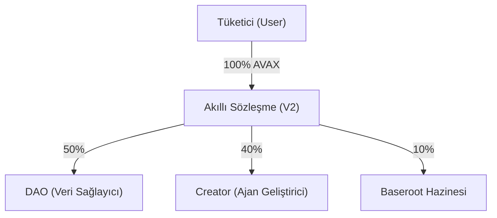

# Baseroot.io — DeSci AI Agent Marketplace (V2)

> **Decentralized AI Agent Marketplace powered by Avalanche (AVAX) blockchain.**


## 🚀 Genel Bakış

Baseroot.io, veri sağlayıcılar (DAO'lar), yapay zeka ajan geliştiricileri (Creators) ve son kullanıcılar (Consumers) arasında güvenli ve şeffaf bir köprü kuran merkeziyetsiz bir pazaryeridir. Platform, DeSci (Merkeziyetsiz Bilim) topluluğu için özel olarak tasarlanmış olup, veri haklarını koruyan **Attestation-based Inference** ve **Avalanche Smart Contract** tabanlı gelir paylaşımı modellerini kullanır.

> [!IMPORTANT]
> Projenin detaylı vizyonu, ekonomik modeli ve teknik mimarisi için **[Baseroot V2 Whitepaper](./WHITEPAPER.md)** dosyasını inceleyebilirsiniz.

## 🔗 Gelir Paylaşım Modeli (50/40/10)

Platformdaki her işlem, akıllı sözleşme (`BaserootMarketplaceV2.sol`) tarafından otomatik olarak 3'e bölünür:



- **Şeffaflık:** Tüm dağılımlar on-chain gerçekleşir ve Snowtrace üzerinden doğrulanabilir.
- **Adalet:** Veri sahibi (DAO) en yüksek payı alarak platformun can damarı olan veri akışını teşvik eder.

## ✨ Öne Çıkan Özellikler

### 🔐 Blockchain & Ekonomi
- **Avalanche Fuji Testnet:** Düşük gecikme süreli ve güvenilir C-Chain entegrasyonu.
- **Virtual Treasury (Claim):** Kullanıcıların veritabanındaki kazançlarını cüzdanlarına çekmelerini sağlayan Web 2.5 muhasebe tabanlı settlement sistemi.
- **On-Chain Gateway:** Harici ajanların kullanımı, akıllı sözleşme üzerindeki lisans kontrolü ile doğrulanır.

### 🤖 Veri Gizliliği & ZK-RAG
- **Zero-Knowledge Inference:** DAO verileri asla ajanı kullanan kişiye veya modelin dışına sızmaz. LLM sadece analiz üretir, ham veriyi göstermez.
- **Dataset Provenance:** Veri setleri zincir üzerinde kayıt altına alınarak fikri mülkiyet hakları (`registerDataset`) korunur.

### 🎨 Modern UI/UX
- **Deep Dark Aesthetic:** Glassmorphism ve Amber vurgulu modern arayüz.
- **Role-Based Dashboards:** Tüketici, Geliştirici ve DAO rolleri için özelleştirilmiş Dashboards.

## 🛠️ Teknoloji Stack

- **Frontend:** React 19, Vite, TailwindCSS 4, Wagmi/Viem, tRPC, Lucide React.
- **Backend:** Node.js/Express, Firebase Firestore (`avax_` prefixed collections), Firebase Auth.
- **Smart Contract:** Solidity (BaserootMarketplaceV2) deployed on **Fuji Testnet**.

## 📦 Kurulum ve Devreye Alma

### Kurulum Adımları

1. **Repoyu klonlayın ve bağımlılıkları yükleyin:**
   ```bash
   pnpm install
   ```

2. **Environment (.env) Ayarları:**
   `.env.example` dosyasını `.env` olarak kopyalayın ve Avalanche Fuji kontrat adresini girin:
   ```bash
   VITE_BASEROOT_MARKETPLACE_ADDRESS=0x3e251B4d78b0351A9E5a7d3df134b8e5870e7782
   ```

3. **Geliştirme Sunucusunu Başlatın:**
   ```bash
   pnpm dev
   ```

## � Sözleşme Bilgileri

- **Network:** Avalanche Fuji (Chain ID: 43113)
- **V2 Smart Contract:** `0x3e251B4d78b0351A9E5a7d3df134b8e5870e7782`
- **Explorer:** [Snowtrace Fuji](https://testnet.snowtrace.io/address/0x3e251B4d78b0351A9E5a7d3df134b8e5870e7782)

---
**Built for the DeSci Community • Powered by Avalanche (AVAX)**
© 2026 Baseroot.io
