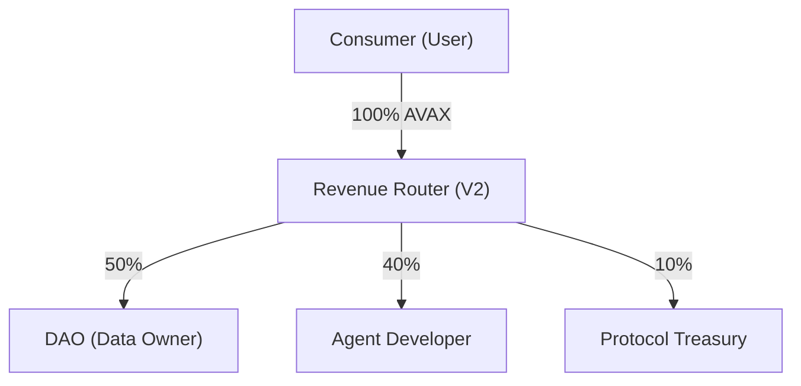

Baseroot is a decentralized infrastructure where AI agents can license datasets and automatically share revenue with data providers on-chain.

# Baseroot V2

### Infrastructure for the Decentralized AI Economy

Baseroot is a decentralized infrastructure that enables AI agents to license datasets on-chain and automatically distribute revenue between DAO data providers, AI creators, and the platform.

The protocol creates a programmable marketplace where knowledge becomes a liquid, tradable asset for AI systems.

**Built for Avalanche Build Games – Stage 2 MVP**

---

## Judge Quickstart (2 Minutes) 🏆

This section helps technical judges quickly verify the MVP.

### 1️⃣ Smart Contracts (Avalanche Fuji)
Dataset licensing and revenue distribution happen on-chain.

- **Explorer:** [`0x46A354d117D3fC564EB06749a12E82f8F1289aA8`](https://testnet.snowtrace.io/address/0x46A354d117D3fC564EB06749a12E82f8F1289aA8)
- **Network:** Avalanche Fuji Testnet (Chain ID: 43113)

**Core functionality:**
- Dataset registration
- AI agent registration
- License purchase
- Automatic revenue distribution

**Revenue model:**
- 50% → DAO (dataset owner)
- 40% → AI Creator
- 10% → Platform

### 2️⃣ GitHub Repository
- **Source code:** [seyitgrbzpng/new-baserootv2-poc](https://github.com/seyitgrbzpng/new-baserootv2-poc)

**Structure:**
- `client/`        → Frontend (React + Web3 wallet)
- `server/`        → Backend services
- `contracts/`     → Smart contracts
- `docs/`          → Architecture & protocol documentation
- `scripts/`       → Deployment scripts
- `tests/`         → Contract tests

### 3️⃣ Live Demo & Walkthrough
- **Live MVP:** [baseroot-v2-marketplace.onrender.com](https://baseroot-v2-marketplace.onrender.com/)
- **Demo Video (~5 minutes):** [Watch on YouTube](https://youtu.be/OgQSvGh17kw)

---

## Problem
AI systems rely heavily on datasets, but today:
- Data providers are rarely compensated.
- Dataset ownership is unclear.
- AI creators have no transparent way to license data.
- Revenue sharing is manual and opaque.

As AI economies grow, data becomes the most valuable resource, yet there is no decentralized market for it.

## Solution
Baseroot introduces a **Dataset Licensing Protocol** for AI agents.

**Key components:**
- **DAO Data Providers:** Upload and monetize datasets.
- **AI Creators:** Deploy agents that can license datasets.
- **On-Chain Licensing:** Agents must purchase licenses before using datasets.
- **Automated Revenue Distribution:** Smart contracts distribute revenue automatically:
  - DAO → 50%
  - Creator → 40%
  - Platform → 10%
  *No intermediaries.*

## MVP Architecture
```text
DAO uploads dataset
        │
        ▼
Dataset stored + registered on-chain
        │
        ▼
Creator deploys AI Agent
        │
        ▼
Agent purchases dataset license
        │
        ▼
License recorded on-chain
        │
        ▼
Revenue automatically distributed
```

### Tech Stack:
- **Blockchain:** Avalanche Fuji (Solidity)
- **Frontend:** React / Vite (Wagmi/Viem)
- **Backend:** Node.js / tRPC
- **Database:** Firebase
- **Wallet:** Web3 wallet integration (MetaMask)

## What This MVP Demonstrates
The MVP validates the core economic primitive of Baseroot:
✔ Dataset registration
✔ AI agent deployment
✔ Dataset licensing
✔ On-chain verification
✔ Automated revenue distribution

This proves the feasibility of a decentralized knowledge marketplace for AI systems.

---

## Technical Deep Dive

### Economic Model: Revenue Routing (50/40/10)
Payments are triggered by successful inference executions or license acquisitions.



### Protocol Abstract
The protocol introduces a new economic layer where knowledge becomes a yield-generating digital asset. By extending the AI agent marketplace model with **Verified Data Pools** and a trustless revenue routing mechanism, Baseroot V2 ensures fair attribution, transparency, and sustainable revenue models for data producers.

> [!IMPORTANT]
> For the complete technical specification and long-term vision, please refer to the **[Baseroot V2 Whitepaper](./WHITEPAPER.md)**.
> For the technical architecture overview, see **[Architecture Overview](./docs/ARCHITECTURE_OVERVIEW.md)**.

## Deployment and Integration

### Option 1: Render (Recommended - 1-Click Deploy)
This project includes a `render.yaml` Blueprint.
1. Connect this repository to your [Render Dashboard](https://dashboard.render.com).
2. Click **New +** > **Blueprint**.
3. Render will automatically build (`pnpm run build`) and start the Node.js server.

### Option 2: Local Setup
1. **Dependencies:** Ensure Node.js 22+ and pnpm 10+ are installed.
2. **Initialize Project:** `pnpm install`
3. **Configure Environment:** Create a `.env` file containing your Firebase and API keys.
4. **Launch Protocol:** `pnpm dev`

---

## Future Roadmap
- Chainlink automation for licensing settlement.
- On-chain dataset reputation.
- Agent marketplace expansion.
- DAO governance layer.
- Multi-chain expansion.

## Why Avalanche
Avalanche provides:
- **Fast Finality:** Near-instant transaction confirmation.
- **Low Fees:** Cost-effective licensing.
- **EVM Compatibility:** Seamless developer experience.
- **Scalable Infrastructure:** Ideal for high-frequency dataset licensing.

---

## License
MIT License

**Foundational Liquidity Layer for Decentralized Knowledge**
*Built for Avalanche Build Games · Powered by Avalanche C-Chain*
© 2026 Baseroot.io
