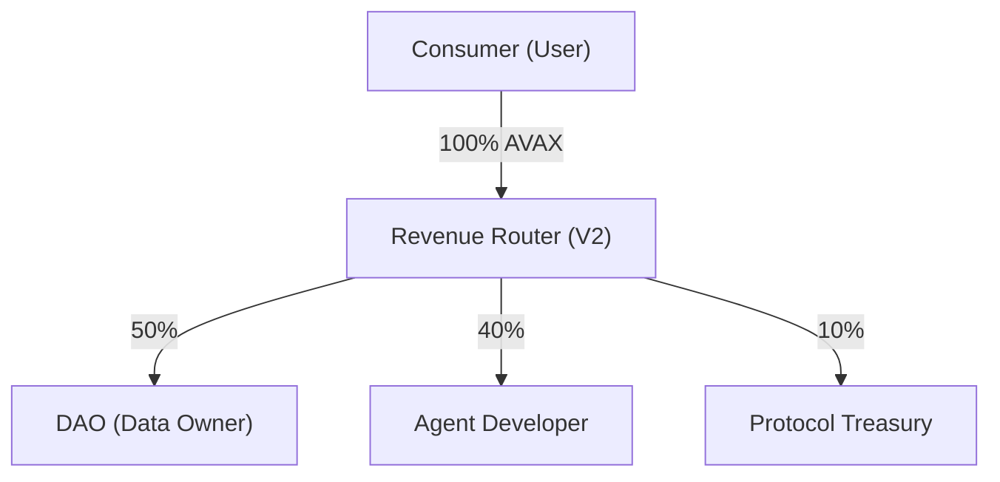

# Baseroot V2: Decentralized Knowledge Liquidity & AI Agent Commerce Protocol

Baseroot V2 is a decentralized protocol designed to enable AI agents to access DAO-owned verified datasets under programmable licenses, while automatically distributing revenue to data owners based on actual usage.

## Protocol Abstract

The protocol introduces a new economic layer where knowledge becomes a yield-generating digital asset. By extending the AI agent marketplace model with **Verified Data Pools** and a trustless revenue routing mechanism, Baseroot V2 ensures fair attribution, transparency, and sustainable revenue models for data producers.

> [!IMPORTANT]
> For the complete technical specification and long-term vision, please refer to the **[Baseroot V2 Whitepaper](./WHITEPAPER.md)**.

## Economic Model: Revenue Routing (50/40/10)

Payments are triggered by successful inference executions or license acquisitions. Revenue is automatically routed between the dataset-owning DAO, the AI agent developer, and the Baseroot protocol via the `BaserootMarketplaceV2.sol` smart contract.

- **Liquidity Layer:** Knowledge assets generate real-time yield for contributors.
- **On-Chain Verification:** All settlements are processed on the Avalanche Fuji Testnet and are verifiable via Snowtrace.

## System Architecture

The Baseroot V2 architecture consists of three primary layers:

1. **On-Chain Registries:** Immutable registries for Agents and Datasets with cryptographic provenance.
2. **Verified Data Pools:** DAO-controlled datasets with programmable licenses and usage-based royalty policies.
3. **Confidential Inference:** A server-side execution environment where AI agents process sensitive DAO data without direct download or exposure, ensuring data sovereignty. *(Uses strict server-side isolation and prompt constraints — not cryptographic zero-knowledge proofs.)*

## Technical Specifications

- **Blockchain:** Avalanche Fuji (Chain ID: 43113)
- **Smart Contract:** `0x46A354d117D3fC564EB06749a12E82f8F1289aA8`
- **Application Stack:** React 19, Vite, TailwindCSS 4, Wagmi/Viem, tRPC, Firebase Firestore.

## Demo Proof Checklist

Use this checklist to verify the end-to-end flow works on-chain:

- [ ] **1. Register Dataset** — DAO uploads a verified data pool via Creator Studio
- [ ] **2. Register Agent** — Developer creates an AI agent linked to the DAO dataset
- [ ] **3. Buy License** — Consumer purchases a license on the Marketplace (AVAX payment)
- [ ] **4. Verify Tx on Snowtrace** — Transaction Proof Card shows Snowtrace link, revenue split, contract address
- [ ] **5. Verify Revenue Split** — Check that 50% DAO / 40% Creator / 10% Protocol balances are correct
- [ ] **6. Duplicate Guard** — Attempt to buy the same license again → should revert with "License already purchased"
- [ ] **7. Run Inference** — Send a prompt to the licensed agent → receive analysis without raw data exposure
- [ ] **8. Check `hasLicense()`** — Call the view function to confirm license existence on-chain

> **Snowtrace Explorer:** https://testnet.snowtrace.io/address/0x46A354d117D3fC564EB06749a12E82f8F1289aA8

## Deployment and Integration

### Dependencies
Ensure Node.js 22+ and pnpm 10+ are installed.

### Setup
1. **Initialize Project:** `pnpm install`
2. **Configure Environment:** Create a `.env` file with the protocol contract address.
3. **Launch Protocol:** `pnpm dev`

---
**Foundational Liquidity Layer for Decentralized Knowledge**
*Powered by Avalanche (AVAX)*
© 2026 Baseroot.io
