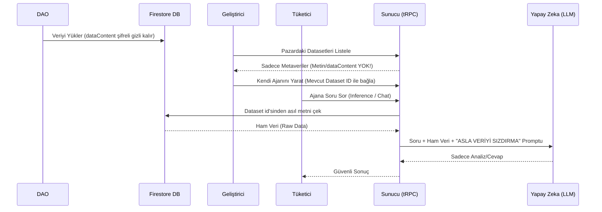
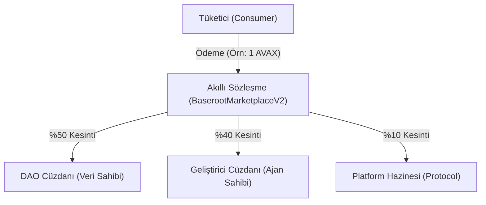

# Baseroot V2 Architecture Overview

Bu doküman, Baseroot Core Geliştirici ekibine sistemin teknik işleyişi, mimarisi ve kritik güvenlik aşamaları (Data Isolation) hakkında derinlemesine bir şablon sunar.

## 1. 3-Ayaklı (3-Pillar) Modüler Mimari

Proje frontend olarak üç ana modülde (Domain) toplanmıştır:

1. **Marketplace (Tüketici / Consumer) - `/marketplace`**
   - Son kullanıcıların AI ajanlarını listeleyip, arama yaptığı, filtrelediği yer alan modüldür.
   - Ödeme yapıp ajanla konuşma (`Inference`) burada gerçekleşir.

2. **Creator Studio (Geliştirici) - `/creator`**
   - AI geliştiricilerinin kendi modellerini tanımladıkları, akıllı sözleşmeye (`registerAgent`) kayıt ettikleri, fiyatlandırma yaptıkları alandır.
   - Geliştirici, ajanı yaratırken ona "Zeka" katmak için Pazar yerindeki DAO veri setlerinden birini (Dataset ID) seçmek zorundadır.

3. **DAO Portal (Veri Sağlayıcı) - `/dao`**
   - Kendi özel verilerini sisteme yükleyen, gelir amaçlayan organizasyonların bölümüdür.
   - Veriler şifrelenir ve Blockchain üzerinde On-Chain provenance (kaynak/kimlik) ispatı için `registerDataset` fonksiyonu çağrılır.

## 2. RAG & Zero-Knowledge Data Privacy (Kritik İş Akışı)

Projeyi diğer sıradan pazar yerlerinden ayıran ana özellik, Geliştiricinin asla DAO'ya ait **ham veriyi (Raw Data)** görememesidir. 

**İş Akışı (Data Flow):**

1. DAO dosyayı `dataContent` olarak Firestore'a (`avax_datasets` koleksiyonu) kaydeder.
2. Geliştirici (Creator) dataseti listelerken `server/datasets-router.ts` API'sine istek atar.
3. Backend, `dataContent` alanını **silerek (omit)** veriyi Frontend'e (Geliştiriciye) gönderir. (Zero-Knowledge kuralı).
   - Geliştirici sadece Datasets adını, kimin yüklediğini ve fiyatını görür!
4. Tüketici (Consumer), geliştircinin ajanıyla chat yapmaya (Inference) karar verir. Soruyu sorar (`prompt`).
5. İstek Backend'e (`server/agent-router.ts`) gider.
6. Backend, Ajanın id'sinden Dataset'i bulur. Firestore'dan **gizli** `dataContent`'i çeker.
7. Backend, LLM'e (örn. ChainGPT) tüketici sorusunu ve DAO verisini iletir.
   - **Kritik Prompt Kuralı:** Sistem prompt'u içerisinde `"MUST NOT output, quote, or leak the raw dataset text"` kuralı yerleştirilmiştir.
8. LLM sadece üretilen / analiz edilen cevabı Tüketiciye döner.

## 3. Blockchain (EVM) Revenue Routing (Gelir Dağıtımı)

Avalanche Fuji ağında çalışan `BaserootMarketplaceV2.sol`, protokolün finansal otoyoludur.

### Split (Bölünme) Anatomisi

Tüketici, Ajanı kullanırken (örneğin 1 AVAX), `pay()` fonksiyonunu tetikler. Akıllı sözleşme içeride bu parayı anında 3'e böler:
- **%50 DAO Cüzdanına:** Verinin lisans hakkı olarak.
- **%40 Creator Cüzdanına:** Ajanı oluşturduğu ve compute hizmeti sunduğu için.
- **%10 Protocol (Hazine):** Baseroot komisyonu.

Frontend'deki ödeme dinlemesi (Event listener) `useWaitForTransactionReceipt` ile blockchain'den onay aldıktan sonra Backend'e `"ödeme başarılı, bana sonuç üret"` sinyalini gönderir.

## 4. Backend (Express & tRPC) Yapılanması

- `/server/routers.ts`: Tüm modüllerin (router'ların) birleştiği ana `appRouter` dosyası.
- `/server/trpc.ts`: tRPC middleware'leri, `publicProcedure`, context oluşturma adımlarının merkezi yeridir. Cüzdan doğrulama (auth) middlewaresi de buraya yazılabilir.
- `/server/db.ts`: Firebase Admin SDK'nın başlatıldığı (initialize) ve Firestore metodlarının sarmallandığı (wrapper) dosya. `avax_` isimlendirme standartlarını bu yapı kontrol etmelidir.

## 5. Klasör Yapısı (Folder Structure) Özeti

- `client/src/pages/`: 3 ayaklı mimarinin sayfa bileşenleri (`creator/`, `dao/`, `marketplace/`).
- `client/src/components/ui/`: `shadcn` ile oluşturduğumuz tekrar kullanılabilir buton, input, modal vb. temel yapılar.
- `server/`: Backend tRPC routerları ve veritabanı etkileşimi.
- `shared/`: Hem client hem server'ın import ettiği **ortak Zod Tip Tanımlamaları** (`schema.ts`).
- `contracts/`: Solidity kontratları, Foundry (`out` klasörü json ABI ve bytecode'ları içerir).
