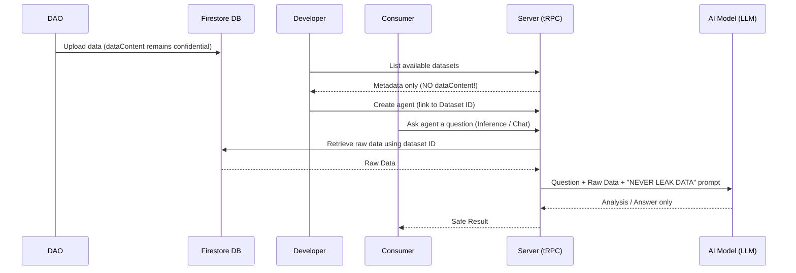
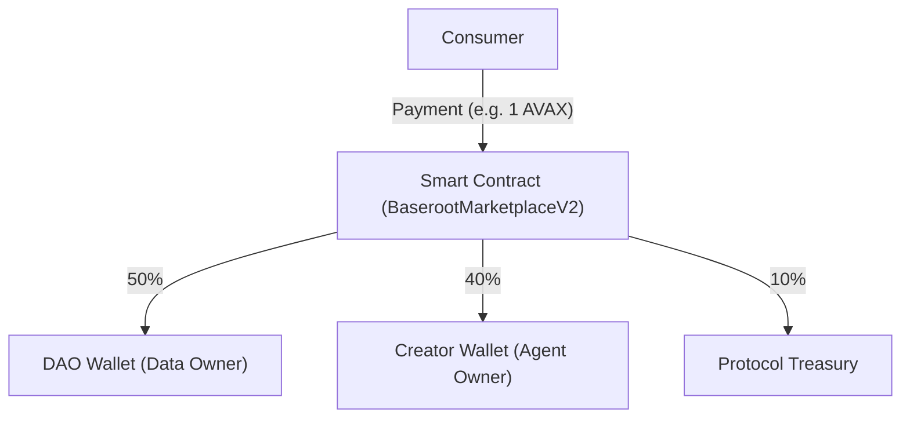

# Baseroot V2 Architecture Overview

This document provides the Baseroot Core Development team with a deep technical reference on the system's architecture, data flows, and critical security layers (Data Isolation).

## 1. 3-Pillar Modular Architecture

The frontend is organized into three domain modules:

1. **Marketplace (Consumer) — `/marketplace`**
   - Where end-users browse, search, and filter AI agents.
   - License purchase and agent inference (chat) happen here.

2. **Creator Studio (Developer) — `/creator`**
   - Where AI developers define their models, register them on-chain via `registerAgent`, and set pricing.
   - Developers must select a DAO dataset (Dataset ID) to power their agent's intelligence.

3. **DAO Portal (Data Provider) — `/dao`**
   - Where organizations upload their proprietary data for revenue generation.
   - Data is encrypted and on-chain provenance is established via `registerDataset`.

## 2. Confidential Dataset Access & RAG Pipeline

The core differentiator: **Developers never see raw DAO data.**

**Data Flow:**

1. DAO uploads data as `dataContent` to Firestore (`avax_datasets` collection).
2. Creator lists datasets via `server/datasets-router.ts` API.
3. Backend **strips `dataContent`** before returning to frontend — developer sees only name, owner, and price.
4. Consumer decides to chat with an agent (Inference). Sends a prompt.
5. Request goes to Backend (`server/agent-router.ts`).
6. Backend looks up the agent's dataset ID, retrieves the **confidential** `dataContent` from Firestore.
7. Backend sends the consumer's question + DAO data to the LLM (e.g., ChainGPT).
   - **Critical Prompt Rule:** System prompt includes `"MUST NOT output, quote, or leak the raw dataset text"`.
8. LLM returns only the generated analysis/answer to the consumer.

## 3. Blockchain (EVM) Revenue Routing

`BaserootMarketplaceV2.sol` on Avalanche Fuji is the protocol's financial backbone.

### Revenue Split Anatomy

When a consumer purchases an agent license (e.g., 1 AVAX), the `buyLicense()` function splits the payment atomically:
- **50% → DAO Wallet:** Dataset licensing royalty.
- **40% → Creator Wallet:** Agent development and compute.
- **10% → Protocol Treasury:** Baseroot commission.

The frontend listens for transaction confirmation via `useWaitForTransactionReceipt`, then signals the Backend to unlock inference.

### On-Chain Functions

| Function | Caller | Purpose |
|----------|--------|---------|
| `registerDataset(datasetId, pricePerUse)` | DAO | Establish data provenance |
| `registerAgent(agentId, price, datasetId)` | Creator | Register agent linked to dataset |
| `buyLicense(agentId)` | Consumer | Purchase license + revenue split |
| `hasLicense(buyer, agentId)` | Anyone | Check if license exists |
| `getLicense(licenseId)` | Anyone | Get license details |

## 4. Backend (Express & tRPC) Structure

- `/server/routers.ts`: Main `appRouter` — combines all module routers.
- `/server/licenseSync.ts`: Event listener for `LicensePurchased` events. Syncs on-chain purchases to Firestore with idempotent writes, retry logic, and `lastSyncedBlock` persistence.
- `/server/blockchain.ts`: Transaction verification, wallet balance checks, and revenue split calculation.
- `/server/services/attribution.ts`: 3-way revenue split (basis points) aligned with the smart contract.
- `/server/firebase.ts`: Firebase Admin SDK initialization and Firestore wrappers. All V2 collections use `avax_` prefix.

## 5. Folder Structure Summary

- `client/src/features/`: 3-pillar page components (`creator/`, `dao/`, `marketplace/`).
- `client/src/components/`: Reusable UI components (shadcn/ui based).
- `server/`: Backend tRPC routers, database interaction, and blockchain sync.
- `shared/`: Common type definitions shared between client and server.
- `contracts/`: Solidity contracts with Hardhat build artifacts.

## 6. Security Summary

| Layer | Mechanism |
|-------|-----------|
| **Data Privacy** | `dataContent` stripped server-side before API response |
| **LLM Leakage Prevention** | Hard prompt constraints forbid raw data output |
| **License Enforcement** | `checkLicenseForAgent()` gates all inference requests |
| **Duplicate Prevention** | `licenseExists` mapping prevents double-purchase per wallet+agent |
| **Idempotent Sync** | License ID as Firestore doc ID prevents duplicate records |
| **Reentrancy Guard** | OpenZeppelin `ReentrancyGuard` on `buyLicense()` |
